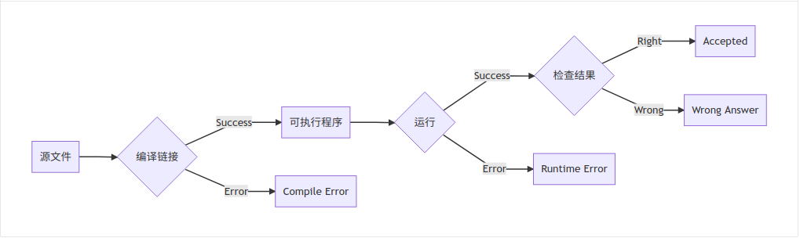
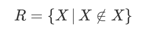
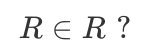

# 计算概论(C语言)习题课讲义01

## 内容概要

1. 作业系统OpenJudge
2. 编程环境CodeBlocks
3. 图灵停机问题

------

## 作业系统：OpenJudge

网址：<http://openjudge.cn/>

### 准备工作

- 网上注册

  [点击此处注册](http://openjudge.cn/register/)，用户名格式：学号+姓名

- 加入小组

  注册完成后，在小组栏目中查找**数院计概（C语言）**，并加入

### 使用演示

提交作业方式：对源代码全选，复制和粘帖。即`Ctrl+A`, `Ctrl+C`, `Ctrl+V`

举例“Hello C”程序

```c
#include <stdio.h>

int main()
{
    printf("Hello C"); /*向屏幕输出结果*/
    return 0;
}
```

### 系统判定流程



还有一些其他错误，例如Time Limit Exceeded/Memory Limit Exceeded等。

#### 一些典型错误

错误一：

```c
#include <stdio.h>

int main()
{
    printf("Hello C") /*向屏幕输出结果*/
    return 0;
}
```

错误二：

```c
#include <stdio.h>

int main()
{
    printf("Hello，C"); /*向屏幕输出结果*/
    return 0;
}
```

错误三：

```c
int main()
{
    printf("Hello C") /*向屏幕输出结果*/
    return 0;
}
```

### 编程建议

OpenJudge的[帮助文档](http://openjudge.cn/help.html)给出了下述建议：

**Guideline 1 Do exactly what the problems demand.**

A mistake made by some newcomers is to print some friendly-looking prompt messages such as “Please input an integer” which the problems do not ask for. Another example of violating this guideline is to leave debug information in the output. Our judge system is automated. There is no human involvement in judging the solutions. Neither the administrators nor the developers will read any output by the solutions in normal circumstances. Hence, unrequested prompt messages are virtually useless. Worse still, undesired output may mess with the judging process, which in all probability will lead to rejection of the solution, even though it is logically correct.

**Guideline 2 Access only the standard input, the standard output and the memory.**

Your solution must always read the input data from the standard input and write the output data to the standard output. The only location that your solution can utilize for storage is the memory. Access to other resources such as disks and the file system is denied by the judge system. Any such attempt results in undefined behavior.

> 名词解释
>
> 标准输入：一般代指键盘；
>
> 标准输出：一般代指屏幕；
>

**Guideline 3 Write standard-conforming code.**

We promote the use of standard-conforming code.

------

## 编程环境：CodeBlocks

### 简介

**The open source, cross platform, free C, C++ and Fortran IDE.**

> 名词解释
>
> open source: 源代码公开
>
> cross platform: Windows/Linux/Mac OS均可使用
>
> IDE: 集成开发环境

### 安装

Windows，[点击此处下载](http://sourceforge.net/projects/codeblocks/files/Binaries/17.12/Windows/codeblocks-17.12mingw-setup.exe)

MacOS，    [点击此处下载](http://sourceforge.net/projects/codeblocks/files/Binaries/13.12/MacOS/CodeBlocks-13.12-mac.zip) （版本有些久远）

### 使用

1. 单个文件

   File->New->File...->C/C++ source->...

   优点：简单明了

   缺点：源文件、目标文件、可执行文件等缺乏组织结构，比较混乱; CodeBlocks中无法使用调试功能

2. 建立项目

   File->New->Project->Console application->C->...

   推荐该种方式

> 名词解释
>
> Console application: 控制台程序，字符化用户界面下的应用程序。
>
> 历史沿革，CUI/CLI vs GUI
>
> CUI:字符化用户界面；例如，Windows中的cmd；古老，但十分高效的计算机操作方式。
>
> GUI:图形化用户界面；例如，窗口，菜单等；降低了计算机的学习成本，客观上促进了计算机的普及。

### 功能

语法高亮，自动缩进，语法提示等等

### 对比：记事本写C语言

以两整数的加法程序为例。

```c
#include <stdio.h>

int main(void)
{
    // 定义变量
    int a, b, c;
    a=1;
    b=2;
    c=a+b;
    printf("%d",c); /*向屏幕输出结果*/
    return 0;
}
```

流程：

1. 编辑器编辑源文件
2. 命令行编译链接（可能需配置PATH环境变量）
3. 运行可执行程序

------

## 图灵停机问题

问题：*是否存在一个程序，它能够计算任何程序在给定输入下是否会结束（停机）？*

答案：*不存在。*

证明：

假如存在这样的程序H，对于任意的给定程序P，以及输入I，都可以判断P在输入I下是否停机。

```c
int H(P, I); // H程序有两种结果，1代表死循环，0表示停机;
```

程序本身也是一种数据，因此它也可以作为输入。故，H也应该可以判定当将P作为P的输入时，P是否会停机。

```c
int H(P, P); // H程序有两种返回值，1代表死循环，0表示停机;
```

然后，我们再定义另外一个程序U。它对于输入P：如果H(P，P)等于1，U程序停机；否则，死循环（不停机）。

```c
int U(P)
{
    if(H(P,P) == 1) // 如果H死循环
    {
        return 0; // 此时U会停机
    }
    else // 否则
    {
        while(1){} // U会死循环
    }
}
```

那么，矛盾来了：U(U)停机么？

> 证明来自网络<https://blog.csdn.net/u014073556/article/details/86382019>

## 其他类似问题

### 理发师悖论

理发师说：“我只给村子里不自己刮胡子的人刮胡子”。

### 罗素悖论

定义集合R，



那么，



### 哥德尔不完备定理

>我们简要理解“哥德尔不完备定理”说的是：一个足够复杂的公理体系（至少蕴含了皮亚诺算术公理），如果它是一致的（相容的，无矛盾的），那么它就是不完备的。这里的完备，指的是“对于任何可在这个公理体系内描述的命题，都可以在这个公理体系内得到判定，要么是正确的，要么是错误的”。
>
>“哥德尔不完备定理”揭示了公理体系内在而深刻的性质和固有局限性，告诉我们不要奢望仅仅通过若干组公理出发，机械地利用基本逻辑规则进行推导，就能够对全部的命题进行判定。从这个意义上讲，无论是数学还是其它科学，都需要不断的完善、扩充自身的公理体系（或者基本规律），只有这样才能不断认知更加深刻复杂的客观世界。或者说，哥德尔真正严格证明了这句格言——“科学研究是永无止境的”。
>
>来自网络<http://blog.sciencenet.cn/blog-409681-1067019.html>