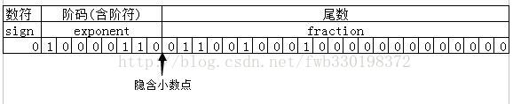

# 计算概论(C语言)习题课讲义02

## 内容概要

- 数的存储

- 字符的存储

### 数的存储

两个事实：

1. 计算机以二进制存储所有的数据，无论是文件、图片，还是视频及程序。

2. 计算机的存储空间是有限的；所以，计算机只能表示有限的数。

#### 整数的存储

> 不同电脑间的变量长度，有所差异。具体可以使用 `sizeof` 运算符测试。

- `short int` 类型的整数用四个字节的二进制表示

- `int` 类型的整数用八个字节的二进制表示

- `long int` 类型的整数用十六字节的二进制表示

- 上述三种类型，未用 `unsigned` 关键词修饰，均表示带符号的整数。即类型的最高一位为符号位，用0表示正数，1表示负数。

所以，根据上述信息，请思考：

- `short int` 类型能够表示的最大整数为？ 再加一的话，结果如何？

- `short int` 类型能够表示的最小整数为？ 再减一的话，结果如何？

- 上述问题中的类型换成 `unsigned short int` 或者 `int` 呢？

#### 演示：整数的上下溢出

#### 小数的存储

> 为什么小数，又被叫做浮点数呢？
>
> 这是由于计算机内部在存储小数时，使用的是如下的二进制的科学计数法： `Number=A*2^B`。其中，A被称为尾数，指数B称为阶码。小数点的位置是“浮动”的，浮点数的名称由此而来。

- `float` 类型为单精度浮点数，长32位，尾数长度23,指数长度8，首位为符号位，指数偏移量127；

- `double` 类型为双精度浮点数，长64位，尾数长度52,指数长度11，首位为符号位，指数偏移量1023；

- 约定小数点左边隐含有一位，通常这位数是1，所以上述单精度尾数的实际长度为24(默认省略小数点左边的1则为23)，双精度尾数长度实际为53（默认省略小数点左边的1则问52）；

> 机器精度
>
> Wikipedia上机器精度Machine Epsilon是这样描述的：“Machine epsilon gives an upper bound on the relative error due to rounding in floating point arithmetic”。因为浮点数是离散的，所以实数的表示存在着误差。例如圆周率这样的无限不循环小数不可能精确地由某一个浮点数表示。
>
>我们需要一些具体的量去刻画这种误差，以估计结果的准确性。机器精度便是其中之一：它是所有相对误差的上限。相对误差是绝对误差与精确值的比值的绝对值。例如一个精确的实数x，所有单精度浮点数中与x距离最近的数为y，绝对误差为|y-x|，相对误差即|y−x|/|x|，而所有相对误差的上限便是单精度浮点数的机器精度。
>
>对单精度而言，是2的-23次方，约为1.1921e-07；对双精度而言，是2的-52次方，约为2.2204e-16。
>
>上述内容[来自网络](https://www.cnblogs.com/fireme/p/3572715.html)

#### 演示：验证机器精度的数值

#### 将178.125转化为单精度浮点数

1. 小数点前整数转化为二进制10110010

2. 小数点后部分转化为二进制001

3. 176.0625转化为二进制10110010.001

4. 转化为指数形式1.0110010001*2^7

5. 结合偏移量确定阶数，7+127=134, 转化为二进制10000110

6. 确定符号位为0

7. 最终得到IEEE754标准下的178.125表示为 0 10000110 0110010001

> 上述内容来自 [网络](https://blog.csdn.net/earthchinagl/article/details/80874388)
>
> 更多参考
> 链接[1](https://en.wikipedia.org/wiki/Machine_epsilon)；
> 链接[2](https://www.geeksforgeeks.org/ieee-standard-754-floating-point-numbers/)；

#### 演示：验证单精度浮点数的存储

### 字符的存储

> 在计算机中，所有的数据在存储和运算时都要使用二进制数表示（因为计算机用高电平和低电平分别表示1和0），例如，像a、b、c、d这样的52个字母（包括大写）以及0、1等数字还有一些常用的符号（例如*、#、@等）在计算机中存储时也要使用二进制数来表示，而具体用哪些二进制数字表示哪个符号，当然每个人都可以约定自己的一套（这就叫编码），而大家如果要想互相通信而不造成混乱，那么大家就必须使用相同的编码规则，于是美国有关的标准化组织就出台了ASCII编码，统一规定了上述常用符号用哪些二进制数来表示。
>
>其中48～57为0到9十个阿拉伯数字,
65～90为26个大写英文字母，97～122号为26个小写英文字母。
>
> 来自[百度百科](https://baike.baidu.com/item/ASCII/309296?fr=aladdin)

#### 演示：验证ASCII编码方式

> C语言的另外一个特殊规定是把字符看成一种特别短的整数，允许程序中直接用
字符的值（也就是字符的编码）参与算数运算。
>
> 出自课本19页

#### 特殊字符的输出

如何使用`printf`函数输出例如双引号，换行符等特殊字符呢？

- 使用ASCII码

- 使用转义字符