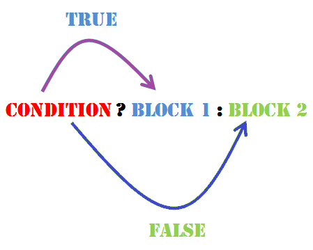

# 计算概论（C语言）习题课讲义04

## 内容概要

- 判断语句

- 循环语句

- 循环算法举例

### 判断语句

```c
if(boolean_expression)
{
   /* 如果布尔表达式为真将执行的语句 */
}
else
{
   /* 如果布尔表达式为假将执行的语句 */
}
```

或者嵌套时，

```c
if(boolean_expression 1)
{
   /* 当布尔表达式 1 为真时执行 */
}
else if( boolean_expression 2)
{
   /* 当布尔表达式 2 为真时执行 */
}
else if( boolean_expression 3)
{
   /* 当布尔表达式 3 为真时执行 */
}
else
{
   /* 当上面条件都不为真时执行 */
}
```

关系表达式只有两种可能的结果，成立为真，反之为假。由于C语言没有专门表示逻辑值的类型，所以任何基本类型的值都可以当做逻辑值使用。零表示假，非零表示真。

#### 演示：零表示假，非零表示真

条件运算符`?:`，可以用来替代 if...else 语句.



#### 注意点

- 5>=3>=1的理解

- 将==打成=的手误

### 循环语句

1. while循环

2. do...while循环

3. for循环

```c
while(condition)
{
   statement(s);
}
```

```c
do
{
   statement(s);
}while(condition);
```

```c
for ( init; condition; increment )
{
   statement(s);
}
```


#### 演示：三种循环方式实现 1+2+...+100

### 循环算法举例

#### 辗转相除法

又名[欧几里得方法](https://en.wikipedia.org/wiki/Euclidean_algorithm)，是求两个整数数最大公约数的经典算法。

原理：`gcd(a,b)=gcd(b,a%b)`

举例，48和20的最大公约数

1. 48/20=2...8

2. 20/8=2...4

3. 8/4=2...0

伪代码

```shell
function gcd(a, b)
    while b ≠ 0
       t := b;
       b := a mod b;
       a := t;
    return a;
```

------

> 名词解释:算法和伪代码

> 算法：In mathematics and computer science, an algorithm is an unambiguous specification of how to solve a class of problems. From [wikipedia](https://en.wikipedia.org/wiki/Algorithm).

不得不提的一个人[Muhammad ibn Musa al-Khwarizmi](https://en.wikipedia.org/wiki/Muhammad_ibn_Musa_al-Khwarizmi)

- The term algebra itself comes from the title of his book.

- His name gave rise to the terms algorism and algorithm.

> 伪代码（pseudocode）是一种非正式的，类似于英语结构的，用于描述模块结构图的语言.使用伪代码的目的是使被描述的算法可以容易地以任何一种编程语言（Pascal，C，Java等）实现。

思考：

1. 基于上面的结果，如何求两个整数的最小公倍数？
2. 基于上面的结果，如何求三个整数的最大公因数？

#### 二分法求根

链接：[Wikipedia](https://en.wikipedia.org/wiki/Bisection_method)

In mathematics, the bisection method is a root-finding method that applies to any continuous functions for which one knows two values with opposite signs.

伪代码：

```shell
INPUT: Function f,
       endpoint values a, b,
       tolerance TOL,
       maximum iterations NMAX
CONDITIONS: a < b,
            either f(a) < 0 and f(b) > 0 or f(a) > 0 and f(b) < 0
OUTPUT: value which differs from a root of f(x) = 0 by less than TOL

N ← 1
While N ≤ NMAX # limit iterations to prevent infinite loop
  c ← (a + b)/2 # new midpoint
  If f(c) = 0 or (b – a)/2 < TOL then # solution found
    Output(c)
    Stop
  EndIf
  N ← N + 1 # increment step counter
  If sign(f(c)) = sign(f(a)) then a ← c else b ← c # new interval
EndWhile
Output("Method failed.") # max number of steps exceeded
```

#### Newton法求根

链接：[Wikipedia](https://en.wikipedia.org/wiki/Newton%27s_method)

In numerical analysis, Newton's method (also known as the Newton–Raphson method), named after Isaac Newton and Joseph Raphson, is a method for finding successively better approximations to the roots (or zeroes) of a real-valued function.


循环终止的条件？

- | f(x) | == 0?

- | f(x) | is small?

- | x-x_old | is small?

Newton方法的鲜明特点是“*局部二次收敛*”；

局部性质：

举例： f(x) =x^3−2x^2 − 11x + 12 = (x − 4)(x − 1)(x + 3)，编程尝试Newton方法在如下初值下的收敛结果。

1. x0=2

2. x0=2.35287527

3. x0=2.35284172

4. x0=2.35283735

二次收敛：

举例：f(x)=x^2-19, 初值取为6，比较每次迭代结果和精确解；并和二分法对比。

#### 求解机器精度的数值

回顾：机器精度是浮点数近似表示时相对误差的上界。即，如果a，b两数如果满足 |a-b| 小于a倍的机器精度时，机器将无法区分a和b；所以，类似于二分法，我们可以通过下述程序，计算机器精度的近似值。

```c
float epsilon_f=1.0;
float tmp_f=1.0+0.5*epsilon_f;
while(tmp_f != 1.0)
{
    epsilon_f=epsilon_f*0.5;
    tmp_f = 1.0+0.5*epsilon_f;
}
```

上述计算结果和理论分析的pow(2,-23)次方接近。

- 修改上面程序，计算双精度类型的机器精度
