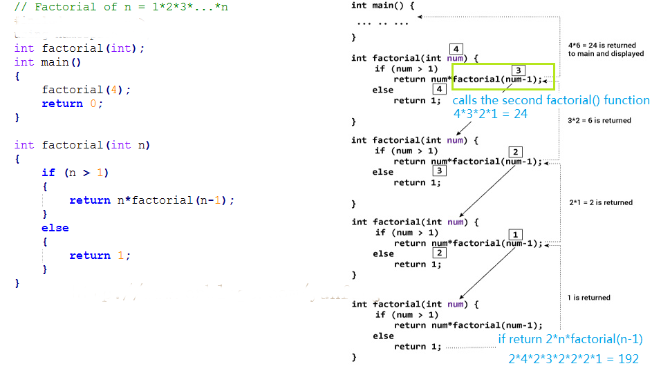

# 计算概论（C语言）习题课讲义05

## 内容概要

- 递归

- 循环

- 调试

### 递归

The process in which a function calls itself directly or indirectly is called recursion.

两个要素：

１.　递归出口

２.　递归公式

```c
int fact(int n)
{
   if (n == 0) // 递归出口
      return 1;
   else
      return n * fact(n - 1);　//递归公式
}
```



#### 演示：调试演示递归程序执行次序

This illustration is in English, rather than an actual programming language, but is useful for explaining the process in a non-technical way:

```shell
A child couldn't sleep, so her mother told a story about a little frog,
  who couldn't sleep, so the frog's mother told a story about a little bear,
     who couldn't sleep, so bear's mother told a story about a little weasel
       ...who fell asleep.
     ...and the little bear fell asleep;
  ...and the little frog fell asleep;
...and the child fell asleep.
```

来自[网络](https://stackoverflow.com/questions/126756/examples-of-recursive-functions)

#### 思考题：Explain the functionality of following functions

```c
int fun1(int x, int y)  
{
  if(x == 0)
    return y;
  else
    return fun1(x - 1,  x + y);
}
```

```c
void fun1(int n)
{
   int i = 0;
   if (n > 1)
     fun1(n-1);
   for (i = 0; i < n; i++)
     printf(" * ");
}
```

```c
#include<stdio.h>
int fun(int a, int b)
{
   if (b == 0)
       return 1;
   if (b % 2 == 0) 
       return fun(a*a, b/2);
   return fun(a*a, b/2)*a;
}
  
int main()
{
  printf("%d", fun(4, 3));
  getchar();
  return 0;
}
```

```c
int fun(int i)
{
  if ( i%2 ) return (i++);
  else return fun(fun( i - 1 ));
}
  
int main()
{
  printf(" %d ", fun(200));
  getchar();
  return 0;
}
```

### 循环

#### Power of Two

Given an integer, write a function to determine if it is a power of two.

From [LeetCode](https://leetcode.com/problems/power-of-two/)

类似的，请完成 [Power of Three](https://leetcode.com/problems/power-of-three/)

#### Climbing Stairs

You are climbing a stair case. It takes n steps to reach to the top.

Each time you can either climb 1 or 2 steps. In how many distinct ways can you climb to the top?

From [LeetCode](https://leetcode.com/problems/climbing-stairs/)

|No |Approach |Time complexity| Space complexity|
|--- |---     |---            | ---             |
|1   |Brute Force   |O(2^n)   | O(n)            |
|2   |Recursion with Memoization |O(n)  |  O(n) |
|3   |Dynamic Programming     | O(n)    |  O(n) |
|4   |Fibonacci Number        | O(n)    |  O(1) |
|5   |Binets Method           |O(log n) |  O(1) |
|6   |Fibonacci Formula       |O(log n) |  O(1) |

From [LeetCode](https://leetcode.com/articles/climbing-stairs/)

#### Reverse Integer

Given a 32-bit signed integer, reverse digits of an integer.

```shell
Example 1:

Input: 123
Output: 321
```

```shell
Example 2:

Input: -123
Output: -321
```

```shell
Example 3:

Input: 120
Output: 21
```

From [LeetCode](https://leetcode.com/articles/reverse-integer/)

### 调试

1. printf大法，即使用printf函数输出中间结果，进行比较；

2. 使用调试器，即使用调试器设置断点，直接查看局部变量的数值、单步执行。

测试代码一

```c
// 某位同学的上次作业
void solution(double a,double b,double c)
{
    double delta;
    delta=(b*b)-4*a*c;
    if (delta>0){
        printf("root1=%lf\n",(-b+sqrt(delta))/2/a);
        printf("root2=%lf",(-b-sqrt(delta))/2/a);
    }
    else {
        if(delta==0){
            printf("root=%lf",-b/2/a);
        }
        else {
        printf("root1=%lf+%lf*i\n",-b/2/a,sqrt(-delta));
        printf("root2=%lf-%lf*i",-b/2/a,sqrt(-delta));
        }
    }
}
```

测试代码二

```c
// 某位同学的上次作业
void root2(double a,double b,double c)
{
    if (a!=0)
    {
        double tmp,q,d=b*b-4*a*c;
        if (d>0)
        {
            tmp=sqrt(d);
            printf("Two real roots:%f,%f\n",
                   (-b-tmp)/2/a,(-b+tmp)/2/a);
        }
        else if(d=0)
        {
            printf("One real root:%f\n",-b/2/a);
        }
        else
        {
            tmp=sqrt(0-(-d));
            printf("No real root\n");
            printf("Two roots:%f+(%f)i,%f+(%f)i\n",-b/2/a,tmp/2/a,-b/2/a,-tmp/2/a);
        }
    }
    else  if(b!=0)
    {
        printf("One real root:%f\n",-c/b);
    }
    else
    {
        printf("No real root\n");
    }
}
```