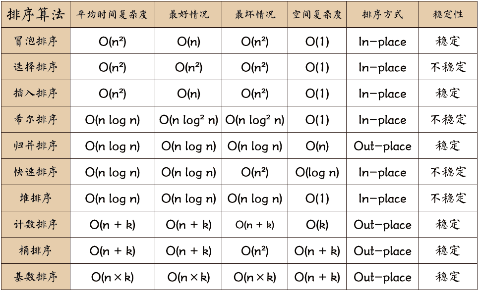

# 计算概论（C语言）习题课讲义09

## 内容概要

- 习题讲解

- 字符串

- 课堂练习: 排序初步

### 习题讲解

#### 字符串转浮点数

代码点评一:

```c
#include <stdio.h>

double t(char a[],const int n)
{
    double x=0;
    int m=n;
    if (a[0]=='\0') return 0.;
    for(int i=0;i<n;++i)
    {
        if(a[i]=='.') m=i; //记录小数点位置
    }
    for (int i=0;i<m;++i)
    {
        x=x*10+a[i]-'0';
    }
    for(int i=m+1,j=10;i<n;++i) //处理小数点
    {
        x=x+(a[i]-'0')/(double)j;
        j*=10;
    }
    return x;
}
int main(int argc, const char * argv[])
{
    char a[5]={'.','1','2','3','\0'}; //可以使用字符串,对字符数组初始化
    char b[4]={'1','2','3','\0'};
    char c[8]={'1','2','3','.','1','2','3','\0'};
    char d[1]={'\0'};
    printf("The real number of 1st input string is: %f\n",t(d,1));
    printf("The real number of 2st input string is: %f\n",t(a,4));
    printf("The real number of 3st input string is: %f\n",t(b,3));
    printf("The real number of 4st input string is: %f\n",t(c,7));
    return 0;
}
```

代码点评二:

```c
#include <stdio.h>
#include <math.h>

double f(char a[]){
    int x=0;
    double s=0;
    for(int i=0;a[i]!='\0';i++){
        if(x) // 以x为标志,分别处理小数部分和整数部分
            s+=(a[i]-'0')*pow(0.1,i-x+1);
        else if(a[i]=='.')
            x=i+1;
        else
            s=s*10+a[i]-'0';
    }
    return s;
}

int main(){
    printf("The real number of 1st input string is: %f\n",f(""));
    printf("The real number of 2st input string is: %f\n",f(".123"));
    printf("The real number of 3st input string is: %f\n",f("123"));
    printf("The real number of 4st input string is: %f\n",f("123.123"));
    return 0;
}
```

#### 约瑟夫环

代码点评一:

```c
#include <stdio.h>

int  monkey(int total, int start, int n)
{
    int monkeys[100];
    for(int i=0;i<total;i++)
    {
        monkeys[i]=1;
    }
    int k=0;
    int remain=total;
    // 主循环
    for(int i=start;;i=(i+1)%total)
    {
        if(monkeys[i]==0)
        {
            continue;
        }
        else
        {
            k++;
            if(k==n) // 数到n,踢掉一猴
            {
                monkeys[i]=0;
                k=0;
                remain--;
                if(remain==1)
                {
                    break;
                }
            }
        }
    }
    //结果...
}

int main()
{
    int m=12; int k=5; int n=10;
    printf("The King is No.%d!!!\n", monkey(m,k,n));
    return 0;
}
```

代码点评二:

```c
#include <stdio.h>

int cxk(int n,int m,int k) // 函数名cxk ?????
{
    int a[n];
    int j=0,p=0,i=0;
    for(int s=0;s<n;s++) a[s]=1;
    for(;;i++)
        if(j==k)
            {a[(m+i-1)%n]=0;
            j=0;--i;++p;}  // --i ?
        else if(a[(m+i)%n]==1)
            {j++;}
        else if(p==n)
            break;

    return (m+i-1)%n;
}
```

代码点评三:

```c
// 通过递推公式
int  monkey_true(int total, int start, int interval) 
{
    int k=0;
    for(int num=2;num<=total;num++)
    {
        k=(k+interval)%num;
    }
    return (k+start)%total;
}
```

注意到问题仅仅是求出最后获胜着的编号,而不是要模拟整个过程. 所以,我们其实可以只考虑获胜者编号和总人数变化关系. 因为总人数为`n`的约瑟夫问题,在进行一轮后,就转化总人数为`n-1`的约瑟夫问题了(但值得注意的是,相当于重新编号了).

先考虑`start=0`的情况

1. 总人数为1, 获胜者为0

2. 若总人数为`n-1`, 获胜者为`k`, 则总人数为`n`时,获胜者为`(k+interval)%n`.

再考虑`start`非零的处理.

#### 计算行列式

代码点评一:

```c
void nu(double a[][4])
{
    //暴力计算
    double m,o,p,q,r;
    m=a[0][0]*(a[1][1]*(a[2][2]*a[3][3]-a[2][3]*a[3][2])-a[1][2]*(a[2][1]*a[3][3]-a[2][3]*a[3][1])+a[1][3]*(a[2][1]*a[3][2]-a[2][2]*a[3][1]));
    o=a[0][1]*(a[1][0]*(a[2][2]*a[3][3]-a[2][3]*a[3][2])-a[1][2]*(a[2][0]*a[3][3]-a[2][3]*a[3][0])+a[1][3]*(a[2][0]*a[3][2]-a[2][2]*a[3][0]));
    p=a[0][2]*(a[1][0]*(a[2][1]*a[3][3]-a[2][3]*a[3][1])-a[1][1]*(a[2][0]*a[3][3]-a[2][3]*a[3][0])+a[1][3]*(a[2][0]*a[3][1]-a[2][1]*a[3][0]));
    q=a[0][3]*(a[1][0]*(a[2][1]*a[3][2]-a[2][2]*a[3][1])-a[1][1]*(a[2][0]*a[3][2]-a[2][2]*a[3][0])+a[1][2]*(a[2][0]*a[3][1]-a[2][1]*a[3][0]));
    r=m-o+p-q;
    printf("%f\n",r);
}
```

代码点评二:

```c
//Definition
double det(double a[][4],int n)
{
    double res=0;
    int seq[24][4]={
        {1,2,3,4},{1,2,4,3},{1,3,2,4},{1,3,4,2},{1,4,2,3},{1,4,3,2},
        {2,1,3,4},{2,1,4,3},{2,3,1,4},{2,3,4,1},{2,4,1,3},{2,4,3,1},
        {3,1,2,4},{3,1,4,2},{3,2,1,4},{3,2,4,1},{3,4,1,2},{3,4,2,1},
        {4,1,2,3},{4,1,3,2},{4,2,1,3},{4,2,3,1},{4,3,1,2},{4,3,2,1}};
    for(int i=0;i<24;i++)
    {
        int k=get_invert(seq[i],n);
        double sign=1;
        if(k%2==1)
        {
            sign=-1;
        }
        double tmp=1;
        for(int j=0;j<n;j++)
        {
            int index=seq[i][j]-1;
            tmp *= a[j][index];
        }
        res += sign*tmp;
    }
    return res;
}
```

代码点评三:

```c
void det(int a[4][4])
{
    //从定义出发
    double s=0;
    for(int i=0;i<4;i++)
    {
        for(int j=0;j<4;j++)
        {
            for(int k=0;k<4;k++)
            {
                int l=6-i-j-k;
                int x=(j-i)*(k-i)*(l-i)*(k-j)*(l-j)*(l-k); //巧妙去掉重复
                int b=a[0][i]*a[1][j]*a[2][k]*a[3][l];
                if(x>0)
                    s+=b;
                if(x<0)
                    s-=b;
            }
        }
    }
    printf("%f",s);
    return;
}
```

代码点评四:

```c
// 从分解出发
double det3(double a[3][3]){
    return a[0][0]*a[1][1]*a[2][2]+a[0][1]*a[1][2]*a[2][0]+a[0][2]*a[1  [0]*a[2][1]-a[0][0]*a[1][2]*a[2][1]-a[0][1]*a[1][0]*a[2][2]-a[0][2]*  [1][1]*a[2][0];
}

double det(double a[4][4]){
    double a1[3][3],a2[3][3],a3[3][3],a4[3][3];
    int i,j;
    for(i=0;i<3;i++)
    {
        for(j=0;j<3;j++)
        {
            a1[i][j]=a[i+1][j];
            a2[i][j]=a[i<1?i:i+1][j];
            a3[i][j]=a[i<2?i:i+1][j];
            a4[i][j]=a[i][j];
        }
    }
    return -a[0][3]*det3(a1)+a[1][3]*det3(a2)-a[2][3]*det3(a3)+a[3][3   *det3(a4);
}
```

代码点评五:

```c
// Guass Elimination
double det_guass(double a[][4],int n)
{
    for(int i=0;i<n;i++)
    {
        // Using i-row to eliminate j-row
        for(int j=i+1;j<n;j++)
        {
            double tmp=a[j][i]/a[i][i];
            a[j][i]=0;
            for(int k=i+1;k<n;k++)
            {
                a[j][k] -= tmp*a[i][k];
            }
        }
    }
    double res=1;
    for(int i=0;i<n;i++)
    {
        res *= a[i][i]; //对角元相乘,即为行列式
    }
    return res;
}
```

### 字符串

在C语言中，字符串实际上是使用字符'\0'终止的一维字符数组.

```c
char greeting[6] = {'H', 'e', 'l', 'l', 'o', '\0'};

//等价于
//char greeting[6] = "Hello";
```

`\0`的作用: 标志字符串的结束. 影响`%s`的输出, `strlen()`的结果等.

**演示: `\0`的作用**

#### 字符串标准库

```c
#include <stdio.h>
#include <string.h>

int main ()
{
   char str1[12] = "Hello";
   char str2[12] = "World";
   char str3[12];
   int  len ;

   /* 复制 str1 到 str3 */
   strcpy(str3, str1);
   printf("strcpy( str3, str1) :  %s\n", str3 );

   /* 连接 str1 和 str2 */
   strcat( str1, str2);
   printf("strcat( str1, str2):   %s\n", str1 );

   /* 连接后，str1 的总长度 */
   len = strlen(str1);
   printf("strlen(str1) :  %d\n", len );

   return 0;
}
```

**注意: `sizeof` 和 `strlen`的区别**

`strlen`是函数，`sizeof`是运算操作符，二者得到的结果类型为`size_t`，即 `unsigned int`类型。`sizeof`计算的是变量的大小，不受字符`\0`影响；
而`strlen`计算的是字符串的长度，以`\0`作为长度判定依据。

```c
char str[20]="0123456789";
int a=strlen(str);  // a=?
int b=sizeof(str);  // b=?
```

参考链接: https://www.runoob.com/w3cnote/strlen-and-sizeof.html

### 课堂练习



#### 插入排序

主要想法:


过程演示:


#### 快速排序

它的基本思想是：通过一趟排序将要排序的数据分割成独立的两部分，其中一部分的所有数据都比另外一部分的所有数据都要小，然后再按此方法对这两部分数据分别进行快速排序，整个排序过程可以递归进行，以此达到整个数据变成有序序列。

一趟快速排序的算法是：

1. 设置两个变量`i`、`j`，排序开始的时候：`i=0`，`j=N-1`；

2. 以第一个数组元素作为关键数据，赋值给`key`，即 `key=A[0]`；

3. 从`j`开始向前搜索，即由后开始向前搜索(`j--`)，找到第一个小于`key`的值`A[j]`，将`A[j]`和`A[i]`的值交换；

4. 从`i`开始向后搜索，即由前开始向后搜索(`i++`)，找到第一个大于`key`的`A[i]`，将`A[i]`和`A[j]`的值交换；

5. 重复第3、4步，直到`i=j`；

参考链接: https://baike.baidu.com/item/%E5%BF%AB%E9%80%9F%E6%8E%92%E5%BA%8F%E7%AE%97%E6%B3%95/369842?fromtitle=%E5%BF%AB%E9%80%9F%E6%8E%92%E5%BA%8F&fromid=2084344&fr=aladdin#4_1

#### 计数排序


#### 基数排序


参考链接:

[1] https://www.toptal.com/developers/sorting-algorithms

[2] https://www.jianshu.com/p/a1e97094f61b